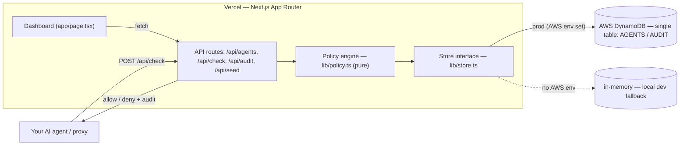

# agentleash cloud

Hosted governance for AI agents: **USD spend caps**, an **egress allowlist**, and a full **audit trail**, with a live dashboard. Your agent (or a proxy in front of it) calls one `/api/check` endpoint before it spends money or reaches an external domain, and this service approves or blocks the action and records it.

This is the hosted version of the open-source [`agentleash`](https://github.com/MukundaKatta/agentleash) library, rebuilt on the H0 "Zero Stack": **Next.js on Vercel + an AWS database (DynamoDB)**.

## Why

Autonomous agents can quietly burn a budget or call domains they should not. `agentleash` solved that in-process as a library. `agentleash cloud` moves the policy and the audit log out of the process, so spend and egress are governed centrally, shown in a dashboard, and enforced the same way across many agents and machines.

## Stack (maps to H0 requirements)

- **Frontend + API**: Next.js (App Router), deployed on **Vercel**.
- **Database**: **Amazon DynamoDB** as the primary backend, single-table design, no GSIs. See `lib/store-dynamo.ts`.
- **Local dev**: with no AWS env set, the app falls back to an in-memory store so it runs instantly. The dashboard badge shows which store is active (`memory` vs `dynamodb`).

## Architecture



The agent (or a proxy in front of it) calls `/api/check` before spending or reaching a domain. The pure policy engine decides allow/deny; the store commits any approved spend and appends an audit record. DynamoDB is the production backend; an in-memory store is used automatically in local dev.

## Run locally

```bash
npm install
npm run dev        # http://localhost:3000  (uses the in-memory store)
```

Click **Seed demo** to populate sample agents and check events (including a couple of denials).

## Deploy on Vercel + DynamoDB

1. Create the table (one table, pay-per-request):
   ```bash
   AWS_REGION=us-east-1 DDB_TABLE=agentleash-cloud bash scripts/create-table.sh
   ```
2. In Vercel project settings add environment variables:
   - `AWS_REGION` (e.g. `us-east-1`)
   - `DDB_TABLE` (e.g. `agentleash-cloud`)
   - `AWS_ACCESS_KEY_ID` / `AWS_SECRET_ACCESS_KEY` for an IAM user with DynamoDB read/write on that table.
3. Deploy. When `AWS_REGION` + `DDB_TABLE` are present, the app uses DynamoDB automatically (the badge reads `store: dynamodb`).

## API

- `POST /api/agents` — `{ name, usdCap, allowedDomains }` creates an agent.
- `GET /api/agents` — list agents + the active backend.
- `GET /api/agents/:id` — one agent + its recent audit events.
- `POST /api/check` — `{ agentId, amountUsd?, domain?, tool? }` returns `{ decision: "allow", remainingUsd }` or `{ decision: "deny", reason, message }`. On an allowed spend the amount is committed. Every call is audited.
- `GET /api/audit?agentId=&limit=` — recent audit events, newest first.
- `POST /api/seed` — create demo data.

### Enforce from your agent

```ts
const res = await fetch("https://<your-app>.vercel.app/api/check", {
  method: "POST",
  headers: { "content-type": "application/json" },
  body: JSON.stringify({ agentId, amountUsd: estCostUsd, domain: "api.openai.com" }),
}).then((r) => r.json());

if (res.decision === "deny") throw new Error(`blocked: ${res.reason}`);
```

## Policy

The decision logic lives in `lib/policy.ts` as a pure function:

- **budget_exceeded** — `spentUsd + amountUsd > usdCap`.
- **domain_not_allowed** — `domain` not in the allowlist (an entry `example.com` also matches its subdomains).
- **unknown_agent** / **invalid_request** — guard cases.

Deny reasons are a closed union, so callers branch on codes, not free-form strings.
